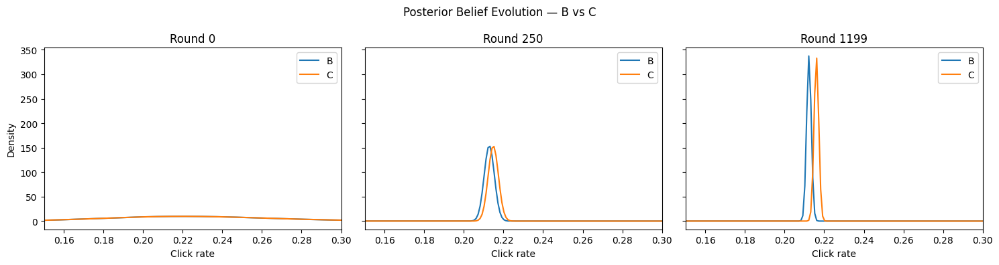
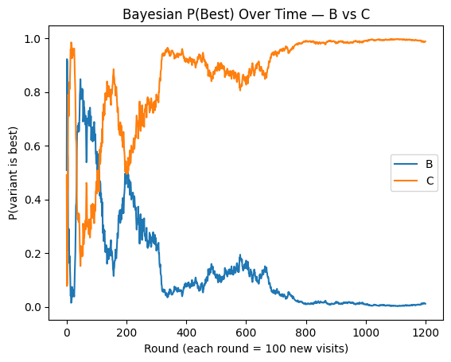
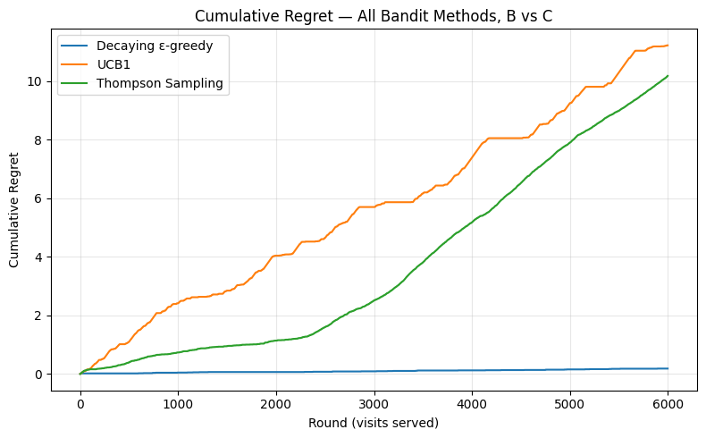

# Evaluating Different A/B Testing for Recommender Systems

**Comparing A/B Testing, Bayesian Testing, and Multi-Armed Bandits for Recommender Model Selection**

---

## Overview

In this project, we train three different recommender systems variants on the MovieLens 100K dataset, then we compare three different experimentation frameworks (classic A/B testing, Bayesian A/B testing, and multi-armed bandits) to see how each performs at identifying the best-performing variant under simulated live traffic. We quantify speed cost and reliability tradeoffs between different ways of deciding which model wins, especially when the true difference between candidates is small.

---

## Motivation

Companies often have to decide, with real users and limited patience, which of several candidate models to actually ship. This project explores the statistical machinery behind that decision: how much data is really needed to trust a result, and what it costs (in wasted traffic, in time, in statistical assumptions) to get there under three different methodologies.

---

## Project Structure

```
recommendertesting/
├── data/
├── notebooks/
│   ├── 01_data_exploration.ipynb
│   ├── 02_model_training.ipynb
│   └── 03_experimental_simulation.
├── LICENSE
├── README.md
├── .gitignore
```

---

## Methodology

### 1. Data

- Dataset: [MovieLens 100K](https://grouplens.org/datasets/movielens/) — 100,000 ratings, 943 users, 1,682 movies
- Click label: `rating == 5` used as a positive/click signal (closer to real-world CTR sparsity than a looser `rating >= 4` cutoff)
- Matrix sparsity: ~93.7% of the user-item matrix is unobserved
- Train/test split: 80/20, stratified on `click`, with a shared split used consistently across all three model variants to keep evaluation comparable
- User-level and item-level historical click-rate features were computed from the training split only, then mapped onto the test split (with a global-average fallback for unseen users/items)

### 2. Models

| Variant | Approach                                                                                      | AUC    |
| ------- | --------------------------------------------------------------------------------------------- | ------ |
| A       | Item-based collaborative filtering (KNNWithMeans, cosine similarity)                          | 0.7796 |
| B       | LightGBM gradient-boosted classifier (genre, demographic, and historical click-rate features) | 0.7921 |
| C       | Hybrid (LightFM: collaborative filtering + genre-based item features)                         | 0.7633 |

Variant B, despite being architecturally simpler than the hybrid model, performed best on this dataset with this configuration.

### 3. Deriving simulated "true CTRs"

Each model's average predicted click probability across the held-out test set was used as that variant's ground-truth CTR for simulation purposes:

| Variant | Simulated true CTR |
| ------- | ------------------ |
| A       | 0.6350             |
| B       | 0.2120             |
| C       | 0.2167             |

**Note on comparability:** Variant A's CTR was derived by linearly rescaling predicted 1–5 ratings into a 0–1 range, while B and C's CTRs come from directly calibrated classification probabilities. This means A's CTR is not on a strictly equivalent footing to B/C's (discussed in the limitations section)

### 4. Traffic simulation

A `TrafficSimulator` class draws simulated visits and returns a click/no-click outcome for a given variant, using a weighted random draw against that variant's true CTR. This allows reproducible 'live traffic' without needing real users.

### 5. Experimentation methods compared

- **Classic A/B testing** — a priori power analysis (10% relative MDE, α=0.05, power=0.8) to size the test, followed by a chi-square test across all three variants and pairwise two-proportion z-tests with Bonferroni correction.
- **Bayesian A/B testing** — Beta-Binomial conjugate updating per variant, with P(variant is best) estimated via Monte Carlo sampling from each variant's posterior at each checkpoint.
- **Multi-armed bandits** — decaying epsilon-greedy, UCB1, and Thompson Sampling, evaluated on cumulative regret and traffic allocation over time.

Each method was first run across all three variants (to confirm correct identification of Variant A's large CTR), but since this variant dominates the results we also ran it B vs. C only (which are closer in CTR).

---

## Results

### Power analysis

| Comparison                              | Required sample size (per variant) |
| --------------------------------------- | ---------------------------------- |
| A vs. B (large effect)                  | 19                                 |
| B vs. C (true effect size)              | 119,670                            |
| B vs. C (10% relative MDE, self-chosen) | 6,116 _(used for the actual test)_ |

### Classic A/B test (n = 6,116 per variant)

- **Chi-square (3-way):** χ² = 3637.43, p ≈ 0.0 which tells us there is significant difference somewhere between the three variants.

- **Pairwise z-tests (Bonferroni-corrected, α = 0.0167):**
  - A vs. B: z = 50.99, p ≈ 0.0 → **significant**
  - A vs. C: z = 50.26, p ≈ 0.0 → **significant**
  - B vs. C: z = -0.84, p = 0.401 → **not significant**

At this sample size, classic A/B testing correctly identifies A's advantage but cannot distinguish B from C — consistent with the power analysis, since 6,116 was sized for a 10% relative MDE, while B and C's true gap is smaller than that, and we would be needed 119,670 samples to acknowledge a significant difference rather than the 6,116 used.

### Bayesian A/B test (B vs. C)

- At **50,000 visits per variant** (500 rounds of 100): P(best) oscillates without converging — no confident winner emerges.
- At **120,000 visits per variant** (1,200 rounds of 100): P(best) plateaus, matching the sample size independently estimated by the power analysis.
- Posterior belief plots (checkpoints at round 0, 250, and 1,199) shows wide distributions early on showing uncertainty in confidence that narrows by the final checkpoint.




### Multi-armed bandits (A vs. B vs. C, 6,000 rounds)

| Algorithm                    | Final cumulative regret  |
| ---------------------------- | ------------------------ |
| Fixed epsilon-greedy (ε=0.1) | ~175 (not shown in code) |
| Decaying epsilon-greedy      | ~45                      |
| UCB1                         | ~12                      |
| Thompson Sampling            | ~9.8                     |

Above we see that when comparing all three variants with variant A clearly dominating, the results about regrets change when only comparing B vs. C. Even though none of the adaptive bandit algorithms fully "resolved" B vs. C within 6,000 rounds (traffic allocation kept hedging close to 50/50 for UCB1 specifically), all three adaptive methods accumulated dramatically less regret than fixed-schedule exploration, because the cost of occasionally picking the "wrong" variant between two very close options is small.



---

## Verdict

Classic A/B testing gave the cleanest result but at a cost. Distinguishing B from C reliably would have required roughly **120,000 visits per variant**, nearly 20x the sample size the test was actually run with. At a smaller, more practical sample size (6,116, chosen via a self-imposed 10% relative MDE), it correctly identified A's obvious advantage but could not distinguish the closer B/C pair, which is expected and appropriate behavior given how the test was sized.

Bayesian A/B testing reached the same underlying conclusion as the power analysis empirically: B vs. C genuinely requires on the order of 120,000 samples to confidently resolve, which the posterior probability plots and belief-evolution plots demonstrated directly, showing oscillation below that threshold and a clear plateau above it. Bayesian testing's main practical advantage over the classic approach is that it doesn't require a large upfront sample-size commitment and tolerates continuous monitoring far better where you can watch the estimate evolve and stop whenever you're satisfied, rather than committing to one fixed test size in advance.

Multi-armed bandits rather than trying to fully resolve which of two nearly-identical variants is better, they minimized the cost of not knowing by adaptively hedging traffic between them. UCB1 and Thompson Sampling both achieved dramatically lower cumulative regret than either fixed-schedule exploration or a classic full-traffic-split A/B test would have accumulated over the same number of visits, even while never fully committing to one winner.

- **Classic A/B testing** when a decision is high-stakes or irreversible, and needs to be defensible and auditable to non-technical stakeholders.
- **Bayesian A/B testing** when I want continuously interpretable results ("92% probability C is best") without committing to a fixed sample size upfront.
- **Multi-armed bandits** when the priority is minimizing the cost of ongoing uncertainty in a live system, rather than needing a definitive answer to "which variant is better."

---

## Limitations

- All traffic is simulated, not real production traffic
- Variant A's simulated CTR was derived by rescaling predicted 1–5 ratings, while Variants B and C's CTRs come from directly calibrated classification probabilities — these are not on a strictly comparable footing, and this asymmetry should be kept in mind when interpreting Variant A's exact CTR value
- The `click == rating 5` threshold is a simplification of real-world CTR behavior and was chosen for tractability, not validated against real user engagement data.
- Bandit algorithms were run with fixed hyperparameters (ε schedule, `no_components`, etc.) rather than tuned; results may differ with further tuning.

---

## Tech Stack

`Python` · `pandas` · `scikit-learn` · `Surprise` · `LightGBM` · `LightFM` · `SciPy` · `statsmodels` · `Matplotlib`

---

## Author

Ananya Singh
